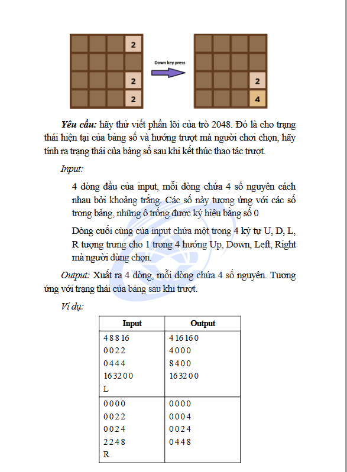

# Đề bài

# Cách giải
## Đối với trường hợp left:
* Đầu tiên tạo 1 mảng B để lưu các giá trị khác 0 của mảng A quét từ trái qua phải, nếu mảng B còn trống thì thêm các số 0 vào cho đủ
* Nếu các phần tử liền kề bằng nhau và khác 0 thì gộp lại thành 1 ô bên trái với giá trị gấp đôi giá trị cũ, ô bên phải = 0
* Tiếp theo lưu các giá trị khác 0 của mảng B quét từ trái qua phải vào mảng A
* Cuối cùng nếu mảng A còn trống thì thêm các số 0 vào cho đủ
## Các trường hợp còn lại làm tương tự như vậy