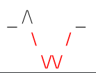
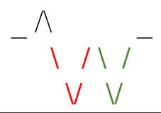

# Đề bài
Tại vị trí hiện tại ngang với mực nước biển, Q thực hiện k bước di chuyển với mỗi bước là lên (U) hoặc xuống (D). Hãy đếm số thung lũng Q đã chinh phục trong k bước đó. Biết rằng, một thung lũng được định nghĩa là một chuỗi các bước liên tục được thực hiện bên dưới mực nước biển, với bước đầu tiên là đi xuống sao cho thấp hơn mực nước biển và bước cuối cùng là leo lên sao cho ngang với mực nước biển.
----------------------------------------------------------------------
**INPUT**
Dòng đầu tiên là số nguyên k thể hiện số bước di chuyển.  (2 ≤ k ≤ 106)
k ký tự thể hiện lên (U) hoặc xuống (D) (cách nhau bởi khoảng trắng)
----------------------------------------------------------------------
**OUTPUT**
Số lượng thung lũng Q đã chinh phục
**EXAMPLE**
-----------
<table border="1" cellpadding="1" cellspacing="1" style="box-sizing: border-box; caption-side: bottom; border-collapse: collapse; color: rgb(62, 63, 58); font-family: Roboto, -apple-system, BlinkMacSystemFont, &quot;Segoe UI&quot;, &quot;Helvetica Neue&quot;, Arial, sans-serif, &quot;Apple Color Emoji&quot;, &quot;Segoe UI Emoji&quot;, &quot;Segoe UI Symbol&quot;; font-size: 16px; font-style: normal; font-variant-ligatures: normal; font-variant-caps: normal; font-weight: 400; letter-spacing: normal; orphans: 2; text-align: start; text-transform: none; widows: 2; word-spacing: 0px; -webkit-text-stroke-width: 0px; white-space: normal; background-color: rgb(255, 255, 255); text-decoration-thickness: initial; text-decoration-style: initial; text-decoration-color: initial; width: 500px;"><tbody style="box-sizing: border-box; border-color: inherit; border-style: solid; border-width: 0px;"><tr style="box-sizing: border-box; border-color: inherit; border-style: solid; border-width: 1px;"><td style="box-sizing: border-box; border-color: inherit; border-style: solid; border-width: 0px;"><strong style="box-sizing: border-box; font-weight: bolder;">Input</strong></td><td style="box-sizing: border-box; border-color: inherit; border-style: solid; border-width: 0px;"><strong style="box-sizing: border-box; font-weight: bolder;">Output</strong></td></tr><tr style="box-sizing: border-box; border-color: inherit; border-style: solid; border-width: 1px;"><td style="box-sizing: border-box; border-color: inherit; border-style: solid; border-width: 0px;">
8

U D D D U D U U
</td><td style="box-sizing: border-box; border-color: inherit; border-style: solid; border-width: 0px;">1</td></tr><tr style="box-sizing: border-box; border-color: inherit; border-style: solid; border-width: 1px;"><td style="box-sizing: border-box; border-color: inherit; border-style: solid; border-width: 0px;">
10

U D D D U U D D U U
</td><td style="box-sizing: border-box; border-color: inherit; border-style: solid; border-width: 0px;">2</td></tr><tr style="box-sizing: border-box; border-color: inherit; border-style: solid; border-width: 1px;"><td style="box-sizing: border-box; border-color: inherit; border-style: solid; border-width: 0px;">
3

D D D
</td><td style="box-sizing: border-box; border-color: inherit; border-style: solid; border-width: 0px;">0</td></tr></tbody></table>
**Giải thích**

*   Với chuỗi U D D D U D U U, chúng ta có thể vẽ ra hình như bên dưới.
    
    
    ( _ thể hiện mực nước biển, / thể hiện bước đi lên, \ thể hiện bước đi xuống)
    
    Có thể thấy trong hình chỉ có 1 thung lũng. Do đó in ra 1.
    
*   Với chuỗi U D D D U U D D U U, chúng ta có thể vẽ ra hình như bên dưới.
    
     
    
    Có thể thấy trong hình có 2 thung lũng (được tô 2 màu khác nhau). Do đó in ra 2.
# Cách giải
* Gọi vị trí hiện tại là sum =0, mỗi khi U tương đương với +1, D tương đương với -1
* Mỗi khi biến sum < 0 thì cờ check sẽ được bật lên, =1
* Khi sum == 0 && check == 1 thì có nghĩa là đã đi hết 1 thung lũng 
