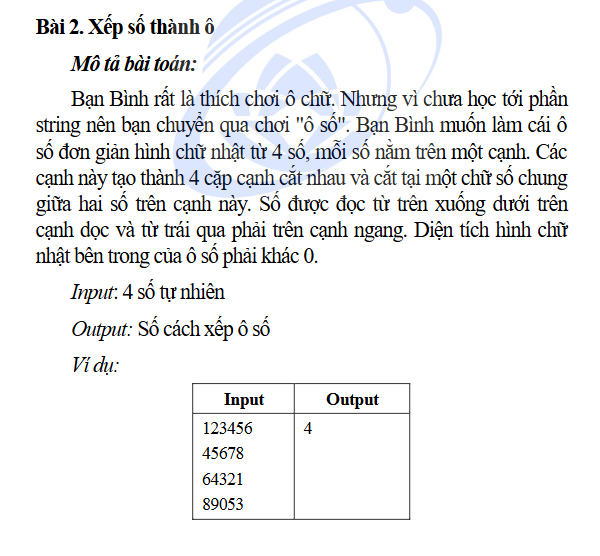
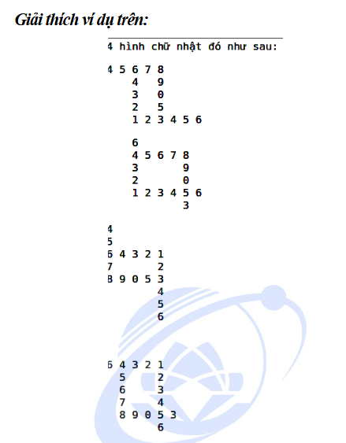

# Đề bài
 
 
 # Cách giải
 * Chúng ta sẽ có 4! cách chọn 4 cạnh top, bottom, left và right
 * Với mỗi cách chọn như vậy ta sẽ xét lần lượt các cặp cạnh với nhau
 * Đầu tiên xét cạnh top với left trước, nếu tìm thấy số giống nhau thì chúng ta tiếp tục xét tiếp các cạnh còn không thì continue
 * Tiếp theo ta xét cặp cạnh top với right với chỉ số của top phải cộng thêm 2 thì ta mới có được diện tích khác 0 và ta có thể tính được width của hình chữ nhật
 * Kế đến bottom và left thì chỉ số của left + 2 và tính được height của hình chữ nhật
 * Cuối cùng là cặp cạnh botttom và right với chỉ số của bottom + width và chỉ số của right + height xem coi 2 số tại đây có bằng nhau không
 * Lặp qua 24 trường hợp để tính xem có bao nhiêu hình chữ nhật